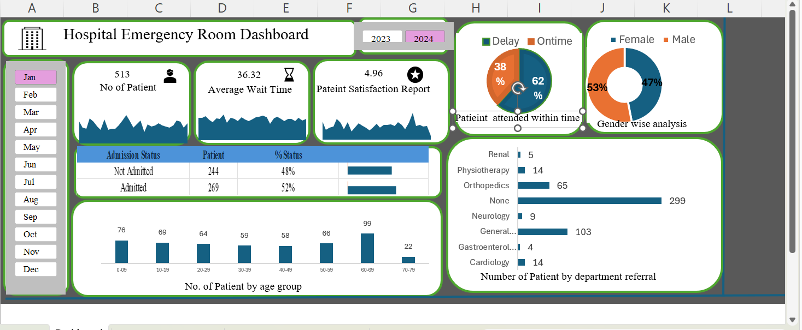
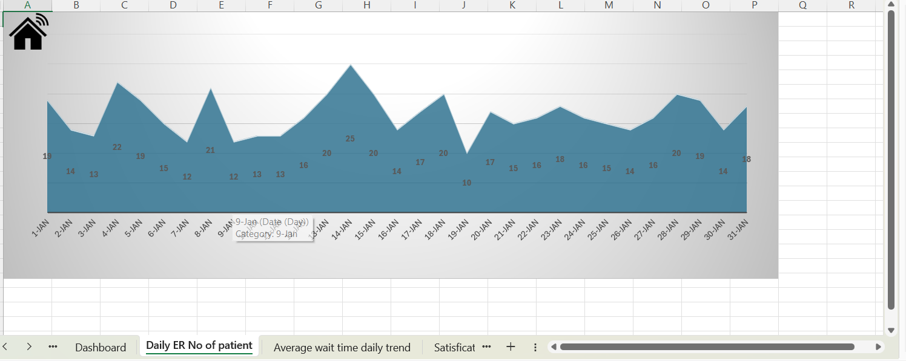
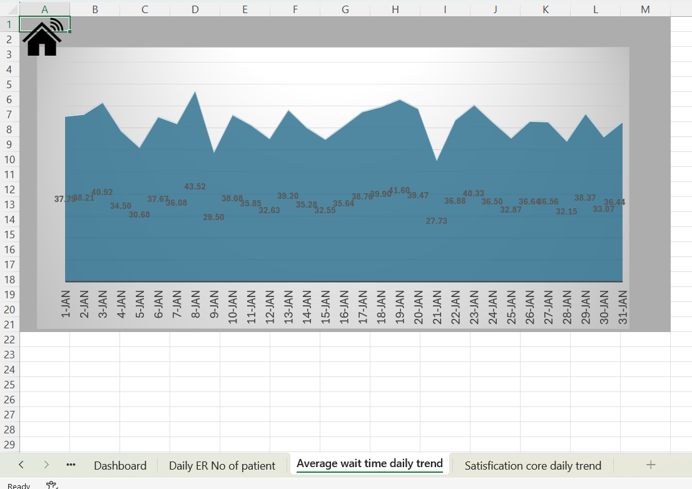
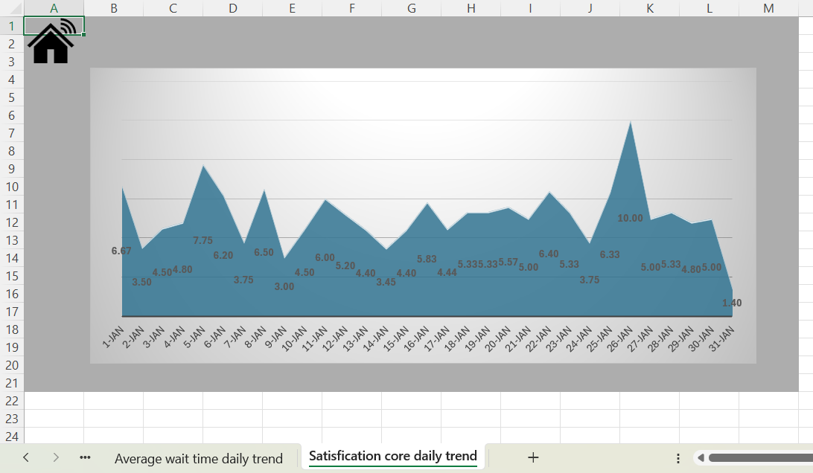

# Hospital Emergency Room Dashboard

This project analyzes Emergency Room (ER) operations using Power Query, and Power Pivot and Microsoft Excel.

---

# Table of Contents
- [Project Overview](#project-overview)
- [Problem Statement](#problem-statement)
- [Project Goal](#project-goal)
- [Dataset Information](#dataset-information)
- [Tools & Technologies Used](#tools--technologies-used)
- [Dashboard Features](#dashboard-features)
- [Key Insights](#key-insights)
- [Recommendations](#recommendations)
- [Business Impact](#business-impact)
- [Dashboard Preview](#dashboard-preview)
- [Author](#author)

---

# Project Overview

The Hospital Emergency Room Dashboard was created to monitor and analyze Emergency Room operations using patient-level hospital data. The dashboard provides a centralized view of important ER metrics such as patient volume, waiting time, patient satisfaction score, admission status, and department referrals.

Using Microsoft Excel, Power Query, and Power Pivot, the raw hospital data was transformed into an interactive dashboard that helps identify operational bottlenecks, monitor patient flow, and support data-driven decision-making for improving Emergency Room efficiency and patient experience.

---

# Problem Statement

Emergency Rooms often face operational challenges such as:
- Long patient waiting times
- Delayed patient attendance
- High patient volume
- Difficulty monitoring operational performance

Without a centralized reporting system, hospital management may struggle to identify bottlenecks, monitor patient experience, and make timely operational decisions.

---

# Project Goal

The objective of this project was to transform raw hospital data into an interactive dashboard that helps:
- Monitor Emergency Room performance
- Track patient waiting times
- Analyze patient admission trends
- Identify busy periods and operational delays
- Support data-driven decision-making

---

# Dataset Information

The dataset was provided in CSV format and included:
- Patient Age
- Gender
- Race
- Department Referral
- Admission Status
- Patient Wait Time
- Patient Satisfaction Score

---

# Tools & Technologies Used

- Microsoft Excel
- Power Query (Data Cleaning & Transformation)
- Power Pivot (Data Modeling, Relationships & DAX Measures)
- Pivot Charts & Dashboard Visualizations
- Slicers & Interactive Filtering
- Sparklines for Trend Analysis
- Hyperlinks for Drill-Through Navigation
- Git and Github for version control and Project management

---

# Dashboard Features

- Total Patient Analysis
- Average Wait Time Tracking
- Patient Satisfaction Monitoring
- Admission Status Analysis
- Gender-wise Patient Distribution
- Age Group Analysis
- Department Referral Analysis
- Delayed vs On-Time Attendance Analysis
- Interactive Filters & Slicers
- Trend Analysis using Sparklines
- Drill-Through Navigation using Hyperlinks to Detailed Analysis Sheets

---

# Key Insights

- 62% of patients experienced delays in attendance.
- The average patient wait time was 36.32 minutes.
- Older age groups showed higher Emergency Room utilization.
- Patient satisfaction scores indicated opportunities for service improvement.
- Certain departments received significantly higher patient referrals, indicating workload concentration.

---

# Recommendations

- Improve triage efficiency to reduce patient delays.
- Increase staffing during peak patient hours.
- Optimize department referral processes.
- Monitor patient wait times regularly to improve service quality.
- Implement operational tracking for better resource allocation.

---

# Business Impact

This dashboard helps hospital management:
- Monitor ER operational efficiency
- Identify patient handling delays
- Improve patient experience
- Optimize staff allocation
- Support data-driven healthcare decisions

---

# Dashboard Overview

---

# Author and Contact

Sapna Devi

sapnadevi9991@gmail.com